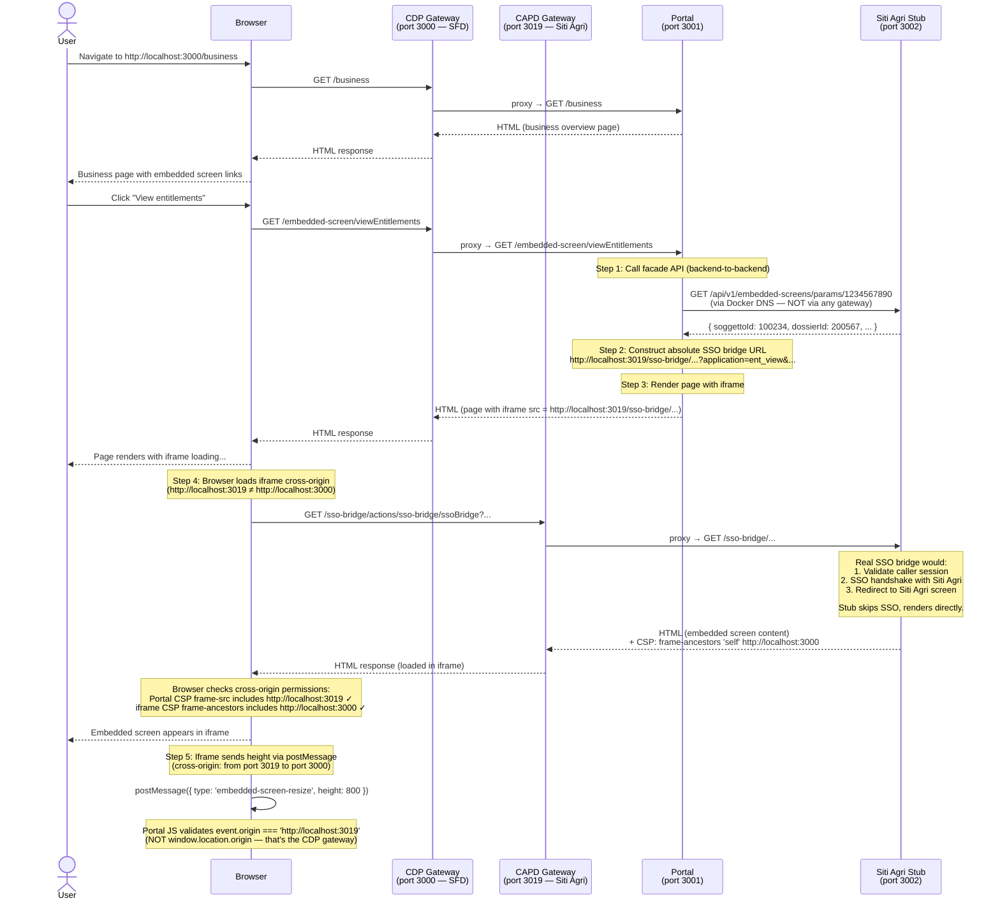
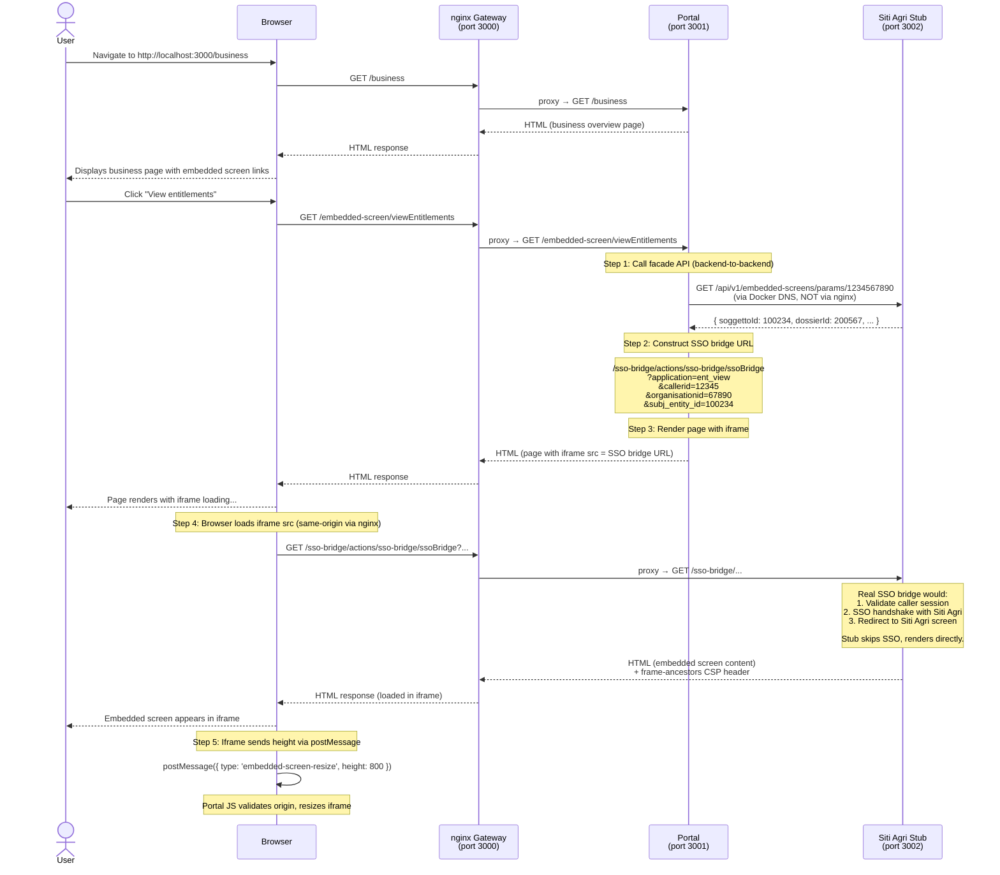

# FCP Embedded Screen Example

This is a reference implementation demonstrating how the **Single Front Door (SFD)** service can embed **Siti Agri** screens within its pages using iframes and an SSO bridge pattern.

The example recreates the embedded screen mechanism used by the current Rural Payments Portal — where a GOV.UK-styled portal renders third-party agricultural software screens (from Siti Agri) inside iframes — using the SFD technology stack: **Hapi.js**, **Nunjucks**, **Node.js**, and the **GOV.UK Design System**.

Critically, the demo models the **real deployment topology**: SFD runs on a **different gateway (CDP)** from Siti Agri **(CAPD)**. This makes the iframe relationship genuinely **cross-origin**, so all cross-origin browser security mechanisms — CSP `frame-src`, `frame-ancestors`, and `postMessage` origin validation — are exercised for real.

> **⚠️ callerId Assumption**: This demo assumes SFD has access to the user's `callerId`. In practice, `callerId` is a CAPD-internal identifier that is **not currently accessible** to services on CDP. The KITS gateway in Crown Hosting resolves `callerId` transparently for backend API calls (SFD → DAL → KITS gateway → CAPD API), but no equivalent mechanism exists for SFD to obtain the raw `callerId` value required for SSO bridge URLs. The SSO bridge URL is loaded by the user's browser as an iframe `src` — no server-side intermediary can inject `callerId` into this browser-initiated request. Before SFD can use embedded screens in production, a resolution mechanism must be implemented. See `portal/src/common/helpers/auth.js` for details.

## What Are Embedded Screens?

In the Rural Payments Service, an **embedded screen** is a Siti Agri application screen that is rendered inside the portal within an `<iframe>`. The user sees the screen as part of the portal journey, but the content is served by Siti Agri infrastructure (a third-party Italian agricultural software system).

The mechanism works through an **SSO (Single Sign-On) bridge**. Rather than requiring the user to separately authenticate against Siti Agri, the portal constructs a parameterised URL pointing to an SSO bridge endpoint. The bridge authenticates the portal user into Siti Agri server-side and redirects the browser to the appropriate Siti Agri screen, which then loads inside the iframe.

There are **12 distinct embedded screen types** in the real system, including:

| Screen Type | Purpose |
|---|---|
| `viewEntitlements` | View BPS entitlements |
| `applyNewBpsApplication` | Apply for new BPS |
| `viewLandUse` | View/edit land use |
| `transferEntitlements` | Transfer entitlements |
| `csClaims` | Countryside Stewardship claims |
| `elmsApplications` | ELM / SFI applications |

This demo implements three representative screen types: **entitlements**, **applications**, and **land use**.

## How It Works

### Two-Gateway Architecture

The new SFD service is deployed on **CDP (Core Delivery Platform)**, behind the CDP API gateway. The current portal and Siti Agri are both hosted on **CAPD (Common Agricultural Delivery Programme)** infrastructure in Crown Hosting. When SFD replaces the portal, it moves to CDP while Siti Agri remains on CAPD — these are different gateways, meaning the SFD portal and Siti Agri content are served from **different origins**.

In the current Rural Payments Portal, the portal and SSO bridge sit behind the **same** gateway, so iframes are same-origin and the browser enforces no cross-origin restrictions. With SFD, this is no longer the case — iframes embed content from a different origin.

The demo models this with a single nginx container running two virtual gateway servers on different ports:

| Gateway | Port | Represents | Routes to |
|---|---|---|---|
| **CDP gateway** | 3000 | SFD on CDP | portal only |
| **CAPD gateway** | 3019 | Siti Agri on CAPD | siti-agri-stub (SSO bridge + Siti Agri UI) |

```
┌──────────────────────────────────────────────────────────────────────────────────┐
│                              User's Browser                                      │
│          Portal pages: http://localhost:3000                                     │
│          Iframe content: http://localhost:3019  (different origin)               │
└──────────────────────────────────────────────────────────────────────────────────┘
              │                                             │
              ▼                                             ▼
┌─────────────────────────────┐             ┌──────────────────────────────────────┐
│   CDP Gateway (port 3000)   │             │     CAPD Gateway (port 3019)         │
│                             │             │                                      │
│   /*  ──► portal:3001       │             │   /sso-bridge/*  ──► siti-agri:3002  │
│                             │             │   /api/*         ──► siti-agri:3002  │
└─────────────────────────────┘             └──────────────────────────────────────┘
              │                                             │
              ▼                                             ▼
┌─────────────────────────────┐             ┌──────────────────────────────────────┐
│     portal (port 3001)      │             │      siti-agri-stub (port 3002)      │
│                             │             │                                      │
│  GOV.UK-styled frontend     │  ─────────► │  Facade API  (screen params)         │
│  Hapi.js + Nunjucks         │  (Docker    │  SSO Bridge  (auth + redirect)       │
│  Renders pages with iframes │   DNS)      │  Siti Agri UI (embedded screens)      │
└─────────────────────────────┘             └──────────────────────────────────────┘
```

The portal calls the facade API **backend-to-backend** via Docker DNS (`http://siti-agri-stub:3002`). This internal network path is separate from the browser-facing CAPD gateway — the portal doesn't need to make a network hop through the gateway to call the API.

### Sequence Diagram



## Cross-Origin Security

Because the SFD portal (CDP gateway) and Siti Agri (CAPD gateway) are different origins, three security mechanisms must be configured. **All three are exercised in this demo**.

### 1. Portal CSP `frame-src` (configured via `FRAME_SRC`)

The portal sets a `frame-src` directive allowing the browser to load the CAPD gateway origin in iframes:

```
Content-Security-Policy: frame-src 'self' http://localhost:3019;
```

Without this, the browser refuses to load the iframe entirely. Configured via the `FRAME_SRC` environment variable in `compose.yml`.

In production:
```
FRAME_SRC=https://api.ruralpayments.service.gov.uk
```

### 2. Siti Agri `frame-ancestors` (configured via `SFD_PORTAL_ORIGIN`)

Siti Agri responses include a `frame-ancestors` header allowing the CDP gateway origin to frame this content:

```
Content-Security-Policy: frame-ancestors 'self' http://localhost:3000;
```

This is the **inverse** of `frame-src` — it's set on the embedded content, not on the portal. Both must agree for the iframe to load. Configured via the `SFD_PORTAL_ORIGIN` environment variable in `compose.yml`.

In production:
```
SFD_PORTAL_ORIGIN=https://your-sfd-service.gov.uk
```

### 3. `postMessage` Origin Validation

The embedded screen sends its content height to the portal via `postMessage` for dynamic iframe resizing. Because the iframe is cross-origin, the message arrives from a **different origin** (`http://localhost:3019`), not from `window.location.origin` (`http://localhost:3000`).

The portal JavaScript reads the expected origin from the `data-origin` attribute (set server-side from `SITI_AGRI_GATEWAY_URL`) rather than using `window.location.origin`:

```javascript
// Read from data-origin attribute, set server-side from SITI_AGRI_GATEWAY_URL
this.expectedOrigin = container.dataset.origin  // 'http://localhost:3019'

window.addEventListener('message', (event) => {
  if (event.origin !== this.expectedOrigin) return  // reject unexpected origins
  // process resize message...
})
```

**Never** use `window.location.origin` as the expected origin in a cross-origin setup — that would reject all messages from the iframe.

### Additional Production Concerns

| Concern | Detail |
|---|---|
| **Cookie `SameSite`** | Cookies set by the Siti Agri iframe need `SameSite=None; Secure` — required for cross-origin iframes in HTTPS |
| **Authorization** | The facade API should verify the caller has access to the requested FRN |
| **Query parameter exposure** | SSO bridge URLs expose sensitive IDs — consider POST or a token exchange |
| **Dynamic CSP nonces** | Always use per-request nonces, never static values |
| **HTTPS** | All resources in the iframe must be HTTPS to avoid mixed content blocking |

## Prerequisites

- Docker
- Docker Compose

## Running the Application

```bash
docker compose up
```

| URL | Description |
|---|---|
| **http://localhost:3000** | CDP gateway — SFD portal (user entry point) |
| http://localhost:3019 | CAPD gateway — Siti Agri SSO bridge (for debugging) |
| http://localhost:3001 | Portal direct (bypasses CDP gateway) |
| http://localhost:3002 | Siti Agri stub direct (bypasses CAPD gateway) |

### Journey

1. **Start page** — explains the demo and offers a "Start now" button
2. **Business overview** — shows business details and links to embedded screens
3. **Embedded screen** — click any link to see a Siti Agri screen rendered in an iframe

### Stopping

```bash
docker compose down
```

## What Each Component Represents

### Portal (`portal/`)

Represents the **SFD frontend** on CDP — a Hapi.js service using the GOV.UK Design System. In production, this would be the main service users interact with, authenticated via Defra Identity.

Key files:
- `src/routes/embedded-screen.js` — orchestrates the embedded screen flow; constructs absolute CAPD gateway URLs for iframe src
- `src/common/helpers/embedded-screens.js` — HTTP client calling the facade API backend-to-backend
- `src/plugins/content-security-policy.js` — CSP `frame-src` including the CAPD gateway origin
- `src/client/javascripts/embedded-screen.js` — postMessage handler; validates against CAPD gateway origin
- `src/views/embedded-screen.njk` — template rendering the iframe; passes `ssoBridgeOrigin` for postMessage validation

### Siti Agri Stub (`siti-agri-stub/`)

Represents **three separate pieces** of Siti Agri infrastructure combined into one service, all deployed on CAPD:

1. **capd-externaldb-facade** (`GET /api/v1/embedded-screens/params/{frn}`) — in production, a Java Dropwizard service querying the SitiAgri Oracle database for organisation identifiers

2. **SSO Bridge** (`GET /sso-bridge/actions/sso-bridge/ssoBridge`) — in production, performs server-side authentication with SitiAgri and redirects to the embedded screen; sets `frame-ancestors` CSP header with the SFD portal origin

3. **Siti Agri UI** (the HTML rendered in the iframe) — in production, an Angular.js application served by SitiAgri infrastructure

Key files:
- `src/routes/embedded-screens-api.js` — facade API returning SitiAgri identifiers
- `src/routes/sso-bridge.js` — SSO bridge simulation; sets `frame-ancestors` from `SFD_PORTAL_ORIGIN`
- `src/data/organisations.js` — mock data (replaces Oracle DB)
- `src/views/screens/*.njk` — embedded screen HTML (non-GOV.UK styling)

### nginx (`nginx/`)

Models the two-gateway topology with two virtual servers in one container:

- **Port 80 (CDP gateway)** — routes `/*` to portal only. Does not serve Siti Agri content.
- **Port 81 (CAPD gateway)** — routes `/sso-bridge/*` and `/api/*` to siti-agri-stub.

## API Contract

### GET /api/v1/embedded-screens/params/{frn}

Called backend-to-backend by the portal. Returns SitiAgri identifiers for constructing the SSO bridge URL.

**Request:**
```
GET /api/v1/embedded-screens/params/1234567890
```

**Response (200 OK):**
```json
{
  "data": {
    "soggettoId": 100234,
    "dossierId": 200567,
    "applicationModelId": 300891,
    "profileModelId": 400123
  }
}
```

**Response (404 Not Found):**
```json
{
  "error": "Organisation not found for FRN: 0000000000"
}
```

### GET /sso-bridge/actions/sso-bridge/ssoBridge

SSO bridge endpoint loaded as the iframe `src`. Served via the CAPD gateway (port 3019).

**Query Parameters:**
| Parameter | Description |
|---|---|
| `application` | SitiAgri screen type (`ent_view`, `apps_list`, `landuse_edit`) |
| `callerid` | The user's CAPD caller ID |
| `organisationid` | The selected organisation's ID |
| `subj_entity_id` | The SitiAgri soggettoId |

**Response:** HTML content of the embedded screen with `Content-Security-Policy: frame-ancestors 'self' http://localhost:3000` header.

## Development

### Running Tests

```bash
# Portal unit tests
docker compose -f compose.yml -f compose.test.yml run --rm portal
```

### Project Structure

```
fcp-embedded-screen-example/
├── compose.yml              # Docker Compose (3 services, nginx on ports 3000+3019)
├── compose.override.yml     # Exposes individual service ports for debugging
├── compose.test.yml         # Test runner configuration
├── nginx/
│   └── nginx.conf           # Two virtual gateways: CDP (port 80) + CAPD (port 81)
├── portal/                  # SFD frontend (GOV.UK Design System, CDP deployment)
│   ├── Dockerfile
│   ├── package.json
│   ├── webpack.config.js    # Bundles GOV.UK Frontend assets
│   └── src/
│       ├── client/          # Browser JS/SCSS (bundled by Webpack)
│       ├── common/helpers/  # Shared utilities (facade API client)
│       ├── config/          # Convict schema (SITI_AGRI_GATEWAY_URL, FRAME_SRC)
│       ├── plugins/         # Hapi plugins (CSP with frame-src, CSRF, router)
│       ├── routes/          # Route handlers (embedded-screen.js is the key one)
│       └── views/           # Nunjucks templates
└── siti-agri-stub/          # Mock Siti Agri infrastructure (CAPD deployment)
    ├── Dockerfile
    ├── package.json
    └── src/
        ├── config/          # Convict schema (SFD_PORTAL_ORIGIN for frame-ancestors)
        ├── data/            # Mock organisation data
        ├── routes/          # API + SSO bridge handlers
        └── views/           # Embedded screen HTML (non-GOV.UK styling)
```

## Mapping to Real Architecture

| This Demo | Real System |
|---|---|
| `portal/` | SFD Frontend on CDP |
| CDP gateway (nginx port 80) | CDP API gateway (SFD) |
| CAPD gateway (nginx port 81) | CAPD gateway (Siti Agri infrastructure) |
| `siti-agri-stub/src/routes/embedded-screens-api.js` | `capd-externaldb-facade` (Java/Dropwizard) |
| `siti-agri-stub/src/routes/sso-bridge.js` | SitiAgri SSO Bridge (separate CAPD infrastructure) |
| `siti-agri-stub/src/views/screens/*.njk` | Siti Agri UI (Angular.js on SitiAgri servers) |
| `siti-agri-stub/src/data/organisations.js` | SitiAgri Oracle Database |
| `FRAME_SRC=http://localhost:3019` | `FRAME_SRC=https://api.ruralpayments.service.gov.uk` |
| `SFD_PORTAL_ORIGIN=http://localhost:3000` | `SFD_PORTAL_ORIGIN=https://your-sfd-service.gov.uk` |
| `SITI_AGRI_GATEWAY_URL=http://localhost:3019` | `SITI_AGRI_GATEWAY_URL=https://api.ruralpayments.service.gov.uk` |
| Simulated auth context (`portal/src/common/helpers/auth.js`) | Defra Identity session + callerId resolution |

## What This Demo Does NOT Cover

- **callerId resolution**: The demo assumes `callerId` is available to SFD — it is not. A resolution mechanism (e.g. SSO bridge accepting Defra Identity tokens, or a callerId lookup service) must be implemented first.
- **Authentication**: No Defra Identity integration (see [fcp-defra-id-example](https://github.com/DEFRA/fcp-defra-id-example))
- **Real SSO handshake**: The stub renders screens directly without an actual SSO flow
- **Interactive forms**: The embedded screens are read-only mock data
- **All 12 screen types**: Only 3 representative types are implemented

## Licence

THIS INFORMATION IS LICENSED UNDER THE CONDITIONS OF THE OPEN GOVERNMENT LICENCE found at:

http://www.nationalarchives.gov.uk/doc/open-government-licence/version/3

The following attribution statement MUST be cited in your products and applications when using this information.

> Contains public sector information licensed under the Open Government licence v3


In the Rural Payments Service, an **embedded screen** is a Siti Agri application screen that is rendered inside the portal within an `<iframe>`. The user sees the screen as part of the portal journey, but the content is served by Siti Agri infrastructure (a third-party Italian agricultural software system).

The mechanism works through an **SSO (Single Sign-On) bridge**. Rather than requiring the user to separately authenticate against Siti Agri, the portal constructs a parameterised URL pointing to an SSO bridge endpoint. The bridge authenticates the portal user into Siti Agri server-side and redirects the browser to the appropriate Siti Agri screen, which then loads inside the iframe.

There are **12 distinct embedded screen types** in the real system, including:

| Screen Type | Purpose |
|---|---|
| `viewEntitlements` | View BPS entitlements |
| `applyNewBpsApplication` | Apply for new BPS |
| `viewLandUse` | View/edit land use |
| `transferEntitlements` | Transfer entitlements |
| `csClaims` | Countryside Stewardship claims |
| `elmsApplications` | ELM / SFI applications |

This demo implements three representative screen types: **entitlements**, **applications**, and **land use**.

## How It Works

### Architecture

The demo consists of three components orchestrated by Docker Compose:

| Component | Port | Role |
|---|---|---|
| **nginx** (gateway) | 3000 | Reverse proxy — user entry point. Makes SSO bridge same-origin with portal. |
| **portal** | 3001 | SFD frontend — GOV.UK-styled pages with iframes for embedded screens |
| **siti-agri-stub** | 3002 | Mock Siti Agri infrastructure — facade API, SSO bridge, and Siti Agri UI |

```
┌─────────────────────────────────────────────────────────────────────┐
│                        User's Browser                               │
│                    http://localhost:3000                            │
└─────────────────────────────────────────────────────────────────────┘
                              │
                              ▼
┌─────────────────────────────────────────────────────────────────────┐
│                      nginx (port 3000)                              │
│                                                                     │
│  /sso-bridge/*  ──────────────────────────► siti-agri-stub:3002     │
│  /api/*         ──────────────────────────► siti-agri-stub:3002     │
│  /*             ──────────────────────────► portal:3001             │
└─────────────────────────────────────────────────────────────────────┘
                     │                              │
                     ▼                              ▼
┌──────────────────────────────┐  ┌──────────────────────────────────┐
│     portal (port 3001)       │  │   siti-agri-stub (port 3002)     │
│                              │  │                                  │
│  GOV.UK-styled frontend      │  │  Facade API (screen params)      │
│  Hapi.js + Nunjucks          │  │  SSO Bridge (auth + redirect)    │
│  Renders pages with iframes  │  │  Siti Agri UI (embedded screens)  │
│                              │  │                                  │
│  Calls facade API ───────────┼──┤  (backend-to-backend)            │
│  (Docker internal DNS)       │  │                                  │
└──────────────────────────────┘  └──────────────────────────────────┘
```

### Sequence Diagram



### Why nginx? (Same-Origin Gateway Pattern)

The nginx gateway is **critical** to making embedded screens work without complex cross-origin configuration.

In the current Rural Payments architecture, the portal and SSO bridge sit behind the **same reverse proxy** (same domain). This means:
- Iframes load same-origin content — no CSP `frame-src` restrictions
- No `frame-ancestors` header needed on iframe responses
- Cookies work normally (no `SameSite=None; Secure` required)
- No CORS configuration needed

Without the gateway, the portal (port 3001) would load iframes from a different origin (port 3002), triggering browser security restrictions that require coordinated changes across both systems.

> **Production deployment**: In CDP, the SFD frontend and the SSO bridge would be behind the same API gateway/reverse proxy, replicating this same-origin pattern at infrastructure level.

## Security Considerations

### Content Security Policy (CSP)

The portal sets a `frame-src` directive controlling which origins can be loaded in iframes:

```
Content-Security-Policy: frame-src 'self';
```

In this demo, `'self'` is sufficient because nginx makes everything same-origin. In a cross-origin deployment, you would need:

```
Content-Security-Policy: frame-src 'self' https://sitiagri.example.defra.gov.uk;
```

### frame-ancestors (Server-Side)

The Siti Agri stub responses include a `frame-ancestors` header:

```
Content-Security-Policy: frame-ancestors 'self' http://localhost:3000;
```

This is the **inverse** of `frame-src` — it tells the browser that THIS content is allowed to be framed by the specified origins. Both directives must agree for the iframe to load.

### postMessage Origin Validation

The portal's JavaScript listens for `postMessage` events from the iframe (used for dynamic resize). **Origin validation is mandatory**:

```javascript
window.addEventListener('message', (event) => {
  // ALWAYS validate the origin — reject messages from unexpected sources
  if (event.origin !== expectedOrigin) return;
  // Process message...
});
```

Never skip origin checks or use `event.origin === '*'`.

### Additional Production Concerns

| Concern | Detail |
|---|---|
| **Cookie SameSite** | If the SSO bridge sets cookies, they need `SameSite=None; Secure` for cross-origin iframes |
| **Authorization** | The facade API should verify the caller has access to the requested FRN |
| **Query parameter exposure** | SSO bridge URLs expose sensitive IDs — consider POST or token exchange |
| **Dynamic CSP nonces** | Always use per-request nonces, never static values |
| **HTTPS** | All resources in the iframe must be HTTPS to avoid mixed content blocking |

## Prerequisites

- Docker
- Docker Compose

## Running the Application

```bash
docker compose up
```

Visit **http://localhost:3000** in your browser.

### Journey

1. **Start page** — explains the demo and offers a "Start now" button
2. **Business overview** — shows business details and links to embedded screens
3. **Embedded screen** — click any link to see a Siti Agri screen rendered in an iframe

### Ports

| Port | Service | Access |
|---|---|---|
| 3000 | nginx gateway | **User entry point** — visit this URL |
| 3001 | Portal (direct) | For debugging — bypasses nginx |
| 3002 | Siti Agri stub (direct) | For debugging — API and SSO bridge |

### Stopping

```bash
docker compose down
```

## What Each Component Represents

### Portal (`portal/`)

Represents the **SFD frontend** — a Hapi.js service using the GOV.UK Design System. In production, this would be the main service users interact with, authenticated via Defra Identity.

Key files:
- `src/routes/embedded-screen.js` — the core route that orchestrates the embedded screen flow
- `src/common/helpers/embedded-screens.js` — HTTP client calling the facade API
- `src/plugins/content-security-policy.js` — CSP configuration including `frame-src`
- `src/client/javascripts/embedded-screen.js` — postMessage handler for iframe resize
- `src/views/embedded-screen.njk` — template rendering the iframe

### Siti Agri Stub (`siti-agri-stub/`)

Represents **three separate pieces** of SitiAgri infrastructure combined into one service:

1. **capd-externaldb-facade** (`GET /api/v1/embedded-screens/params/{frn}`) — in production, a Java Dropwizard service that queries the SitiAgri Oracle database for organisation identifiers

2. **SSO Bridge** (`GET /sso-bridge/actions/sso-bridge/ssoBridge`) — in production, a dedicated component that performs server-side authentication with SitiAgri and redirects to the embedded screen

3. **Siti Agri UI** (the HTML rendered in the iframe) — in production, an Angular.js application served by SitiAgri infrastructure

Key files:
- `src/routes/embedded-screens-api.js` — facade API returning SitiAgri identifiers
- `src/routes/sso-bridge.js` — SSO bridge simulation
- `src/data/organisations.js` — mock data (replaces Oracle DB)
- `src/views/screens/*.njk` — embedded screen HTML (non-GOV.UK styling)

### nginx (`nginx/`)

Represents the **reverse proxy / API gateway** that makes the SSO bridge same-origin with the portal. In the current CAPD infrastructure, this is nginx/haproxy. In CDP, this would be the platform's API gateway.

## API Contract

### GET /api/v1/embedded-screens/params/{frn}

Returns SitiAgri identifiers needed to construct the SSO bridge URL.

**Request:**
```
GET /api/v1/embedded-screens/params/1234567890
```

**Response (200 OK):**
```json
{
  "data": {
    "soggettoId": 100234,
    "dossierId": 200567,
    "applicationModelId": 300891,
    "profileModelId": 400123
  }
}
```

**Response (404 Not Found):**
```json
{
  "error": "Organisation not found for FRN: 0000000000"
}
```

### GET /sso-bridge/actions/sso-bridge/ssoBridge

SSO bridge endpoint loaded as the iframe `src`.

**Query Parameters:**
| Parameter | Description |
|---|---|
| `application` | SitiAgri screen type (`ent_view`, `apps_list`, `landuse_edit`) |
| `callerid` | The user's CAPD caller ID |
| `organisationid` | The selected organisation's ID |
| `subj_entity_id` | The SitiAgri soggettoId |

**Response:** HTML content of the embedded screen with `Content-Security-Policy: frame-ancestors` header.

## Development

### Running Tests

```bash
# Portal unit tests
docker compose -f compose.yml -f compose.test.yml run --rm portal
```

### Project Structure

```
fcp-embedded-screen-example/
├── compose.yml              # Docker Compose orchestration (3 services + nginx)
├── compose.override.yml     # Exposes individual ports for debugging
├── compose.test.yml         # Test runner configuration
├── nginx/
│   └── nginx.conf           # Reverse proxy routing rules
├── portal/                  # SFD frontend (GOV.UK Design System)
│   ├── Dockerfile
│   ├── package.json
│   ├── webpack.config.js    # Bundles GOV.UK Frontend assets
│   └── src/
│       ├── client/          # Browser JS/SCSS (bundled by Webpack)
│       ├── common/helpers/  # Shared utilities (API client)
│       ├── config/          # Convict schema + Nunjucks setup
│       ├── plugins/         # Hapi plugins (CSP, CSRF, router)
│       ├── routes/          # Route handlers
│       └── views/           # Nunjucks templates
└── siti-agri-stub/          # Mock Siti Agri infrastructure
    ├── Dockerfile
    ├── package.json
    └── src/
        ├── config/          # Convict schema
        ├── data/            # Mock organisation data
        ├── routes/          # API + SSO bridge handlers
        └── views/           # Embedded screen HTML (non-GOV.UK styling)
```

## Mapping to Real Architecture

| This Demo | Real System |
|---|---|
| `portal/` | SFD Frontend on CDP |
| `siti-agri-stub/src/routes/embedded-screens-api.js` | `capd-externaldb-facade` (Java/Dropwizard) |
| `siti-agri-stub/src/routes/sso-bridge.js` | SitiAgri SSO Bridge (separate infrastructure) |
| `siti-agri-stub/src/views/screens/*.njk` | Siti Agri UI (Angular.js on SitiAgri servers) |
| `siti-agri-stub/src/data/organisations.js` | SitiAgri Oracle Database |
| `nginx/nginx.conf` | CDP API Gateway / Platform reverse proxy |
| Simulated auth context (`portal/src/common/helpers/auth.js`) | Defra Identity session + callerId resolution |

## What This Demo Does NOT Cover

- **callerId resolution**: The demo assumes `callerId` is available to SFD — it is not. A resolution mechanism (e.g. SSO bridge accepting Defra Identity tokens, or a callerId lookup service) must be implemented first.
- **Authentication**: No Defra Identity integration (see [fcp-defra-id-example](https://github.com/DEFRA/fcp-defra-id-example))
- **Real SSO handshake**: The stub renders screens directly without an actual SSO flow
- **Cross-origin deployment**: This demo uses same-origin via nginx; a real cross-origin setup requires coordinated CSP, frame-ancestors, and cookie changes
- **Interactive forms**: The embedded screens are read-only mock data
- **All 12 screen types**: Only 3 representative types are implemented

## Licence

THIS INFORMATION IS LICENSED UNDER THE CONDITIONS OF THE OPEN GOVERNMENT LICENCE found at:

http://www.nationalarchives.gov.uk/doc/open-government-licence/version/3

The following attribution statement MUST be cited in your products and applications when using this information.

> Contains public sector information licensed under the Open Government licence v3
